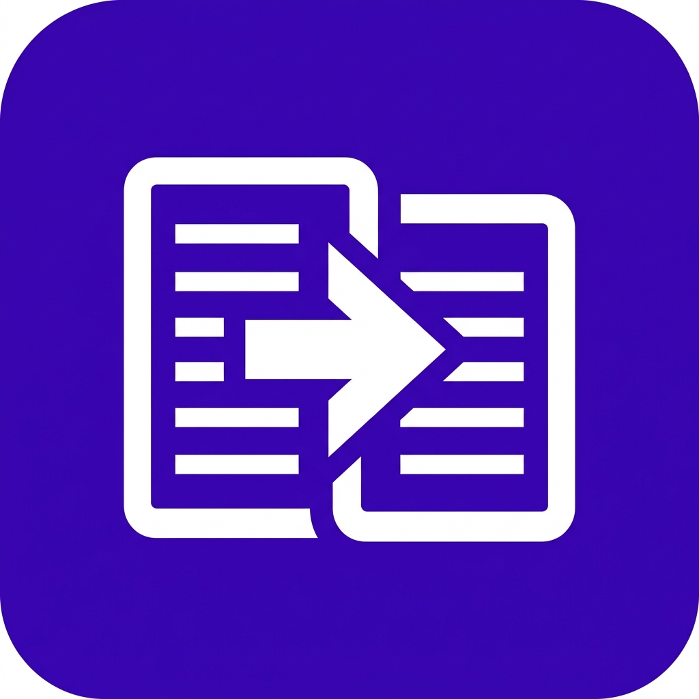

# ⚡ KeySnap (스마트 텍스트 대치 유틸리티)

<p align="center">
  
</p>

<p align="center">
  <b>macOS의 텍스트 대치를 Windows 환경에서 완벽하게 구현한 고성능·초경량 전역 단축어 유틸리티</b><br>
  자주 쓰는 문장, 인사말, 이메일, 특수문자, 코드 스니펫을 단축키 하나로 즉시 완성하세요.
</p>

<p align="center">
  <a href="https://blog.naver.com/factoryud"></a>
  
  
  
</p>

---

## 📥 다운로드 (Releases)

GitHub **[Releases (다운로드 바로가기)](https://github.com/UD-FACTORY/KeySnap/releases)** 탭에서 최신 버전을 다운로드하실 수 있습니다:

| 파일명 | 종류 | 설명 | 크기 |
| :--- | :--- | :--- | :--- |
| **`KeySnap-Setup-v1.0.0.exe`** | **표준 설치 프로그램 (권장)** | .NET 런타임 없이 모든 Windows PC에서 즉시 설치 및 실행 | ~66 MB |
| **`KeySnap-Setup-v1.0.0-Lite.exe`** | **초경량 설치 프로그램** | .NET 8 Desktop Runtime이 설치된 PC용 초고속 설치 파일 | ~3 MB |
| **`KeySnap.exe`** | **무설치 포터블 단일 파일** | 설치 과정 없이 USB나 원하는 폴더에서 바로 더블클릭 실행 | ~1.1 MB |

---

## ✨ 핵심 기능

### 1. 전역 텍스트 대치 (Global Text Replacement)
- 카카오톡, 슬랙, 노션, 웹 브라우저, MS Office, 메모장 등 **모든 Windows 응용 프로그램**에서 단축어 타이핑 즉시 치환.
- **한글 자모/초성 분해 엔진 내장:** 영문 타자 상태나 한글 조합 상태와 무관하게 `ㅇㅈ` ➔ `인정합니다. 👍`, `ㄱㅅ` ➔ `감사합니다! 좋은 하루 보내세요. 😊` 등 완벽 치환.

### 2. 사용자 지정 임의 단축키 (트리거 키) 녹화
- 단축어 입력 후 어떤 키를 눌러 대치할지 사용자가 원하는 키를 직접 지정할 수 있습니다.
- **[환경설정] ➔ [⌨ 단축키 변경]**을 누르고 키보드에서 원하는 조합(`Tab`, `Space`, `Ctrl + Space`, `Shift + Space`, `Alt + Q`, `F1`~`F12`, `Ctrl + Enter` 등)을 누르면 즉시 등록됩니다.

### 3. 안전한 클립보드 복원 파이프라인
- 치환 시 기존 클립보드 내용을 임시 백업한 후, 텍스트를 고속 주입하고 원래 클립보드로 복원하여 작업 중이던 데이터 손실을 원천 차단합니다.

### 4. 동적 매크로 태그
- `{{today}}` 또는 `!오늘날짜` : 현재 날짜 (예: `2026-09-23`)
- `{{time}}` 또는 `!현재시간` : 현재 시각 (예: `14:55:00`)
- `{{clipboard}}` 또는 `!클립보드` : 현재 클립보드 텍스트 내용 삽입

### 5. 예외 프로그램 관리 (블랙리스트)
- 게임(리그 오브 레전드, 발로란트 등)이나 금융 보안 프로그램 등 텍스트 대치를 원치 않는 프로그램을 등록하면 해당 프로그램 실행 중에는 자동으로 대치를 건너뜁니다.
- 실행 중인 프로세스 목록에서 원클릭으로 손쉽게 추가 가능합니다.

### 6. 시스템 트레이 상주 & 원클릭 전역 토글
- 창을 닫아도 시스템 트레이로 부드럽게 숨겨져 방해 없이 백그라운드 구동.
- 트레이 아이콘 우클릭으로 원클릭 전역 대치 켜기/끄기 및 종료 제어.

---

## 🛠️ 개발 및 빌드 환경

- **언어 및 프레임워크:** C# (.NET 8.0 Windows WPF)
- **UI 아키텍처:** MVVM 패턴 (Pure C# + XAML)
- **인스톨러 컴파일러:** Inno Setup 6.7+

### 소스코드 빌드
```powershell
# 저장소 복제
git clone https://github.com/UD-FACTORY/KeySnap.git
cd KeySnap

# 빌드 및 실행
dotnet build
dotnet run --project QuickReplace.csproj

# 단위 테스트 실행 (18개 테스트 통과)
dotnet test QuickReplace.Tests/QuickReplace.Tests.csproj
```

### 설치 파일(Setup.exe) 직접 빌드
```powershell
# 1. 자체 포함(Self-contained) 단일 실행 바이너리 발행
dotnet publish QuickReplace.csproj -c Release -r win-x64 --self-contained true -p:PublishSingleFile=true -p:EnableCompressionInSingleFile=true -o publish_selfcontained

# 2. Inno Setup 컴파일러(ISCC)로 설치 프로그램 패키징
& "C:\Users\<User>\AppData\Local\Programs\Inno Setup 6\ISCC.exe" installer/KeySnap_Setup.iss
# 결과물: dist/installer/KeySnap-Setup-v1.0.0.exe
```

---

## 👨‍💻 제작자 정보

- **개발:** 유디연구소 (UD Factory)
- **공식 블로그:** [https://blog.naver.com/factoryud](https://blog.naver.com/factoryud)
- 문의 및 기능 제안은 GitHub Issues 또는 블로그를 통해 남겨주세요.

---

## 📄 라이선스 (License)

This project is licensed under the MIT License - see the [LICENSE](LICENSE) file for details.
