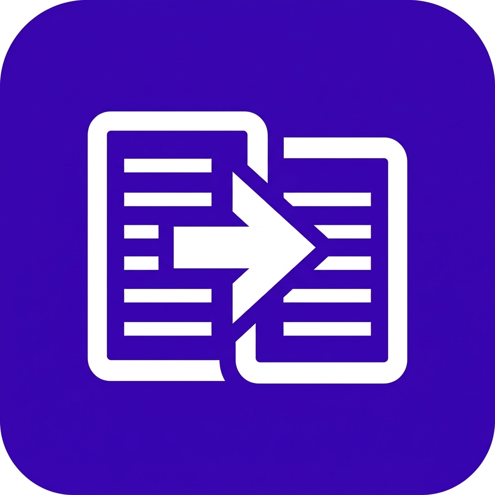

# ⚡ KeySnap (스마트 텍스트 대치 유틸리티)

<p align="center">
  
</p>

<p align="center">
  <b>macOS의 텍스트 대치를 Windows 환경에서 완벽하게 구현한 고성능·초경량 전역 단축어 유틸리티</b><br>
  자주 쓰는 문장, 인사말, 이메일, 특수문자, 코드 스니펫을 단축키 하나로 즉시 완성하세요.
</p>

<p align="center">
  <a href="https://blog.naver.com/factoryud"></a>
  
  
  <a href="https://github.com/UD-FACTORY/KeySnap/releases"></a>
</p>

---

## 📥 다운로드 (Releases)

GitHub **[Releases (다운로드 바로가기)](https://github.com/UD-FACTORY/KeySnap/releases/latest)** 페이지에서 최신 버전을 다운로드하실 수 있습니다:

| 파일명 | 종류 | 설명 | 링크 |
| :--- | :--- | :--- | :---: |
| **`KeySnap-Setup-v1.1.0.exe`** | **표준 설치 프로그램 (권장)** | 바탕화면/시작메뉴 바로가기 및 부팅 시 자동 실행 지원 설치 파일 | [다운로드](https://github.com/UD-FACTORY/KeySnap/releases/download/v1.1.0/KeySnap-Setup-v1.1.0.exe) |
| **`KeySnap_사용설명서.pdf`** | **공식 사용자 매뉴얼** | 고해상도 스크린샷과 상세 활용법이 담긴 PDF 안내서 | [다운로드](docs/KeySnap_사용설명서.pdf) |

> [!NOTE]
> 본 프로그램은 Windows 10/11 64비트 환경을 지원하며, `.NET 8 Desktop Runtime`이 기본적으로 필요합니다. (Windows 최신 업데이트 시 자동 포함 또는 [Microsoft 공식 사이트](https://dotnet.microsoft.com/download/dotnet/8.0)에서 무료 설치 가능)

---

## ✨ 핵심 기능

### 1. 전역 텍스트 대치 (Global Text Replacement)
- 카카오톡, 슬랙, 노션, 웹 브라우저, MS Office, 메모장 등 **모든 Windows 응용 프로그램**에서 단축어 타이핑 즉시 치환.
- **한글 자모/초성 분해 엔진 내장:** 영문 타자 상태나 한글 조합 상태와 무관하게 `ㅇㅈ` ➔ `인정합니다. 👍`, `ㄱㅅ` ➔ `감사합니다! 좋은 하루 보내세요. 😊`, `!email` ➔ `user@example.com` 등 완벽 치환.
- 단축어 추가/수정 즉시 백그라운드 키보드 훅 엔진에 실시간 동기화.

### 2. 🔄 변환 실행 방식 전역 설정 (환경설정)
모든 단축어에 공통 적용될 텍스트 치환 방식을 환경설정에서 손쉽게 전환할 수 있습니다:
- **단축키(트리거 키) 입력 시 변환 (기본 권장):** 단축어를 입력한 후 설정된 트리거 키(`Tab`, `Space` 등)를 누르면 해당 키를 가로채어 깔끔하게 대치 문구로 변환합니다. (일반 텍스트 작성 중 오동작 원천 차단)
- **즉시 변환 (단축어 타이핑 완료 즉시):** 단축어의 마지막 글자를 입력하자마자 추가 키 없이 대치 문구로 즉시 자동 변환합니다.

### 3. ⌨️ 사용자 지정 임의 단축키(트리거 키) 녹화
- 단축어 입력 후 어떤 키를 눌러 대치할지 원하는 키를 자유롭게 설정할 수 있습니다.
- **[환경설정] ➔ [⌨ 단축키 변경]** 클릭 후 키보드에서 원하는 조합(`Tab`, `Space`, `Ctrl + Space`, `Shift + Space`, `Alt + Q`, `F1`~`F12` 등)을 누르면 즉시 등록됩니다.

### 4. 안전한 클립보드 복원 파이프라인
- 치환 시 기존 클립보드 내용을 임시 백업한 후 대치어를 고속 주입하고 원래 클립보드로 복원하여 작업 중이던 데이터 손실을 원천 차단합니다.

### 5. 동적 매크로 태그 지원
- `{{today}}` 또는 `!오늘날짜` : 현재 날짜 (예: `2026-09-28`)
- `{{time}}` 또는 `!현재시간` : 현재 시각 (예: `13:15:00`)
- `{{clipboard}}` 또는 `!클립보드` : 현재 클립보드에 복사된 텍스트 내용 자동 삽입

### 6. 예외 프로그램 관리 (블랙리스트)
- 게임(리그 오브 레전드, 발로란트 등)이나 금융 보안 프로그램 등 텍스트 대치를 원치 않는 프로그램을 등록하면 해당 프로그램 실행 중에는 자동으로 대치를 건너뜁니다.
- 실행 중인 프로세스 목록에서 원클릭으로 손쉽게 추가/삭제 가능합니다.

### 7. 시스템 트레이 상주 & 원클릭 전역 토글
- 창을 닫아도 시스템 트레이로 부드럽게 숨겨져 방해 없이 백그라운드 구동.
- 트레이 아이콘 우클릭으로 원클릭 전역 대치 켜기/끄기 및 종료 제어.

---

## 📖 사용 설명서 (Manual)

자세한 화면 구성 및 단계별 사용법은 고해상도 스크린샷이 포함된 공식 PDF 매뉴얼을 참조하세요:
- 📄 **[KeySnap 공식 사용설명서 보기 / 다운로드 (PDF)](docs/KeySnap_사용설명서.pdf)**

---

## 🛠️ 개발 및 빌드 환경

- **언어 및 프레임워크:** C# (.NET 8.0 Windows WPF)
- **UI 아키텍처:** MVVM 패턴 (Pure C# + XAML)
- **CI/CD:** GitHub Actions 자동 릴리즈 빌드 파이프라인

### 소스코드 빌드
```powershell
# 1. 저장소 복제
git clone https://github.com/UD-FACTORY/KeySnap.git
cd KeySnap

# 2. 빌드 및 실행
dotnet build -c Release
dotnet run --project QuickReplace.csproj

# 3. 단일 실행 파일 발행
dotnet publish -c Release -r win-x64 --self-contained false -p:PublishSingleFile=true -o dist/
```

---

## 👨‍💻 제작자 정보

- **개발:** 유디연구소 (UD Factory)
- **공식 블로그:** [https://blog.naver.com/factoryud](https://blog.naver.com/factoryud)
- 문의 및 기능 제안은 GitHub Issues 또는 블로그를 통해 남겨주세요.

---

## 📄 라이선스 (License)

This project is licensed under the MIT License - see the [LICENSE](LICENSE) file for details.
